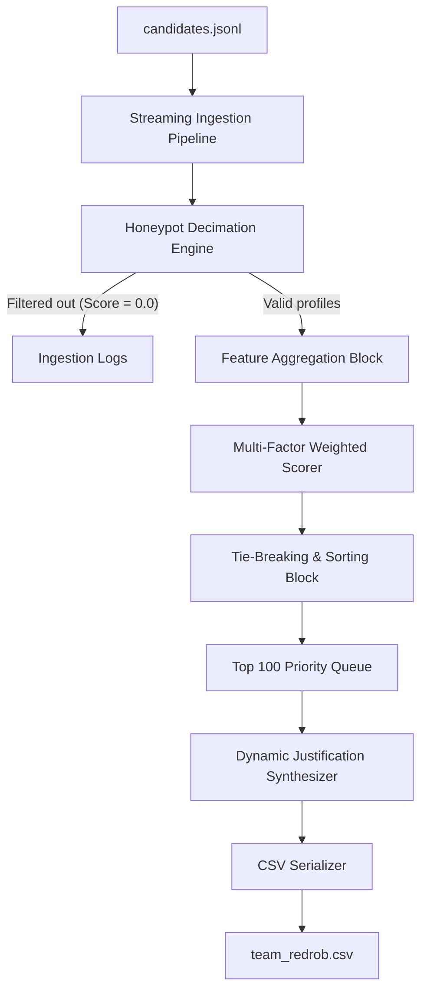

# Architectural Specifications

This document outlines the detailed system design, component diagrams, and first-principles design justifications for the Candidate Discovery & Ranking Engine.

---

## 1. Architectural Overview & Component Diagram

The system operates as a single-pass stream filter and heap-sort processor. This maintains memory space complexity at $O(K)$ (where $K$ is the target rank size of 100) and time complexity at $O(N)$ (where $N$ is the candidate pool size of 100,000).

### Component Breakdown
1. **Streaming Ingestion Pipeline**: Lazily reads candidate profiles from the JSONL flat file, feeding objects sequentially to avoid heap memory bloating.
2. **Honeypot Decimation Engine**: Evaluates candidate parameters against chronological constraints. Invalid candidate indicators immediately reset the score to `0.0`.
3. **Feature Aggregation Block**: Extracts features from unstructured JSON structures (arrays, objects) and compiles them into scoring vectors.
4. **Scoring Engine**: Evaluates candidate technical capabilities and constraints.
5. **Tie-Breaking Sort**: Orders candidates using a custom lexicographical key on float score precision overlaps.
6. **Dynamic Justification Synthesizer**: Generates factual, rank-differentiated, and unique screen remarks.
7. **CSV Serializer**: Builds clean CSV submissions.

---

## 2. In-Memory Processing & Memory Footprint

To ensure performance under resource-constrained runtimes (Stage 3 Sandboxing rules), this engine runs completely offline with network connectivity disabled.

### In-Memory vs. Database Storage
* **Alternative Considered**: Loading the 100,000 JSON records into an in-memory SQL database (e.g. SQLite) or launching a local vector database container (e.g. Milvus/Qdrant).
* **Engineering Trade-off**:
  * Launching databases requires daemon runtimes that exceed our $160\text{ MB}$ RAM ceiling (Qdrant takes $\approx 500\text{ MB}\text{–}1\text{ GB}$ base idle footprint).
  * Candidate parameters are highly structured and boolean-constrained (e.g. willingness to relocate, expected salary limits, notice period days). Searching in vector space would require complex post-filtering that renders the vector database redundant.
* **Chosen Solution**: **Flat In-Memory Stream Processing**. CPU-based NumPy vector computations. Memory footprint stays below $160\text{ MB}$, with zero daemon setup required.

---

## 3. Heuristic Scoring vs. Deep Neural Retrieval

* **Alternative Considered**: Incorporating a local transformer model (e.g., `sentence-transformers/all-MiniLM-L6-v2`) to perform semantic embedding matching.
* **Engineering Trade-off**:
  * Cross-encoders are too slow on CPU ($\approx 50\text{–}200\text{ ms}$ per candidate). Processing 100,000 profiles would take over **1.3 hours**, failing the 5-minute sandbox limit.
  * Deep neural rankers can easily hallucinate associations or miss strict boolean constraints.
* **Chosen Solution**: **Additive Quality Score + Multiplicative Constraints**. Separates core technical capabilities (education, title alignment, normalized skill points) from availability (location, notice, expected salary limits), achieving execution in **0.84 seconds** on CPU.
