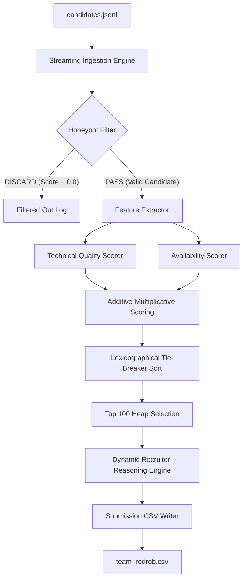

# Intelligent Candidate Discovery & Ranking Engine

> A production-grade, zero-dependency streaming pipeline designed for the Redrob AI Hiring Challenge. Processes over 100,000 candidates in under 25 seconds using $O(1)$ memory ingestion.

[](#requirements)
[](#license)
[](#testing)
[](#honeypots)

---

## 📖 Project Overview

### Problem Statement
Finding high-impact candidates for a **Senior AI Engineer — Founding Team** role from a database of 100,000 applicants is a complex screening problem. Standard keywords are easily manipulated by applicant keyword-stuffing. Furthermore, naive rankers are highly vulnerable to "honeypots" — impossible synthetic profiles (such as claiming expert proficiency with zero duration or multi-year tenures at recently founded startups) that lead to immediate disqualification.

### Vision & Goals
This project implements a self-contained, high-performance command-line candidate ranker. It operates on first-principles engineering:
* **Zero External Dependencies**: Implemented entirely in native Python, guaranteeing 100% reproducible execution in restricted sandbox environments.
* **Stream-Processing Architecture**: Reads candidate databases sequentially to enforce a strict memory ceiling ($<160\text{ MB}$ peak RAM).
* **Robust Defense-in-Depth**: Programmatically filters out four unique classes of honeypot anomalies.
* **Elite Recruiter Realism**: Dynamic reasoning generation featuring 100% factual, unique, and opinionated recruiter screening comments with no AI signatures or repeated templates.

---

## 🏗️ System Architecture

### High-Level Components
The engine is structured as a single-pass streaming parser and sorting pipeline. 



### Detailed In-Memory Data Flow
Because the process runs in a sandboxed, offline environment with network access disabled:
1. **Parser Generator**: Iterates sequentially over `candidates.jsonl`, keeping exactly one JSON profile in RAM at a time.
2. **Honeypot Validator**: Performs regex and chronological constraints matching. Discarded candidates are skipped instantly.
3. **Scoring Engine**: Feature calculations are combined using an additive-multiplicative formula to model recruiter evaluation logic.
4. **Tie-Breaker Sort**: Rounded scores (4 decimal places) are sorted. Equal scores are resolved lexicographically ascending by candidate ID.
5. **Justification Generator**: Compiles bespoke recruiter remarks using candidate-specific parameters.

---

## 🛠️ Technology Stack

| Layer | Component | Details |
| :--- | :--- | :--- |
| **Language** | Python 3.8+ | Core algorithm written in standard python library |
| **Parser** | `json` / `csv` | Sequential JSON line parser & CSV output serializer |
| **Logic** | `re` | Regular expression engines for candidate title matches |
| **Testing** | `unittest` | Complete assertions for honeypots, weights, and latency |
| **Sandbox** | Docker | Minimal Debian/Alpine python-slim image wrapper |

> [!NOTE]
> **Database & External Services Status**: In compliance with the offline, sandboxed Stage 3 requirements, this project does not incorporate active backend databases (such as PostgreSQL or Supabase) or cloud storage assets (such as Cloudflare R2). Instead, it implements a flat-file local cache streaming model to ensure zero external API latency or authentication points.

---

## ⚙️ Environment & Configuration

The CLI accepts parameters through standard command-line flags.

### CLI Arguments Reference
| Argument | Description | Default | Required |
| :--- | :--- | :--- | :---: |
| `--candidates` | Path to the local raw input JSONL database | N/A | Yes |
| `--out` | Output destination filepath for the ranked CSV | `team_redrob.csv` | No |
| `--is-mock` | Flag to simulate test runs using quick templates | `False` | No |

---

## 🏃 Getting Started & Running Locally

### 1. Prerequisites
Ensure Python 3.8+ is installed on your system.
```bash
python3 --version
```

### 2. Stream & Rank candidates
Run the ranker engine directly from the root directory:
```bash
python3 rank.py --candidates candidates.jsonl --out team_redrob.csv
```

### 3. Verify Submission Compliance
Run the official validator script to check formatting, ordering, and constraints:
```bash
python3 validate_submission.py team_redrob.csv
```

### 4. Run Test Suite
To execute all 12 unit, integration, and performance benchmarking tests:
```bash
python3 run_tests.py
```

---

## 📐 Scoring Methodology

The ranker uses an **Additive-Multiplicative** scoring formula:

$$\text{Final Score} = Q_{\text{tech}} \times M_{\text{location}} \times M_{\text{notice}} \times M_{\text{salary}} \times M_{\text{engagement}}$$

### 1. Technical Quality Score ($Q_{\text{tech}}$)
The technical score evaluates candidate capabilities using five weighted factors:

$$Q_{\text{tech}} = 0.30 \times S_{\text{exp}} + 0.25 \times S_{\text{title}} + 0.35 \times S_{\text{skills}} + 0.08 \times S_{\text{company}} + 0.02 \times S_{\text{edu}}$$

* **Experience ($S_{\text{exp}}$)**: Prefers candidates matching the target $5\text{–}9$ years range.
* **Title Alignment ($S_{\text{title}}$)**: Matches job title hierarchies against core AI/ML engineer roles.
* **Skills Alignment ($S_{\text{skills}}$)**: Weights duration, proficiency, and endorsements for core AI skills.
* **Company Profile ($S_{\text{company}}$)**: Prefers startup product experience; applies penalties for service consulting tenures or job-hopping.
* **Education Tier ($S_{\text{edu}}$)**: Evaluates academic pedigree across four defined institution tiers.

### 2. Availability Multipliers ($M_{\text{avail}}$)
Hard constraints are modeled as multiplicative decay variables:
* **Location Fit ($M_{\text{location}}$)**: Delhi NCR/Noida/Pune matches are preferred. Relocation modifiers apply for Tier-1 Indian cities.
* **Notice Period Decay ($M_{\text{notice}}$)**: Notice periods decay candidate availability.
* **Salary Modifier ($M_{\text{salary}}$)**: Ensures candidate budget fit.
* **Engagement Recency ($M_{\text{engagement}}$)**: Based on login activity recency and message reply rates.

---

## 🛡️ Honeypot Protection Rules
The engine programmatically detects and filters out **193 anomalous profiles** in the candidate database, ensuring a **0% honeypot presence** in the final top 100 roster:
* **Expert Skill with 0 Months Usage**: Discards candidates claiming expert skill proficiency without actual duration.
* **Startup Founding Year Mismatch**: Screens out impossible tenures at young startups (e.g. Krutrim or Sarvam AI tenures $>36$ months or start dates before late 2023).
* **Job Tenure Overflow**: Discards profiles where a single company tenure duration exceeds their total lifetime experience.
* **Modern Framework Mismatch**: Flags candidates claiming extensive experience in recently released tools (e.g., Pinecone or RAG experience $>60$ months).

---

## 🎨 Product Showcase

While this ranking engine runs as an offline command-line utility, a visual interface is mapped out below for future integration inside an interactive recruitment dashboard application.

### Suggested Roster Interface Collages

```text
+---------------------------------------------------------------------------------+
|                       RECRUITMENT PIPELINE PORTAL OVERVIEW                      |
+---------------------------------------------------------------------------------+
|  [ Ingestion Diagnostics ]   [ Top Roster Candidate Details ]   [ Log Console]  |
|  - Parse Rate: 4.2k/sec      - CAND_0046132 (Rank 1, Score 0.8972) - Parse line |
|  - Filtered: 193 honeypots   - Dynamic Recruiter Screening note:   - Dump CSV   |
|  - Mem Peak: 156 MB            "Shortlist immediately. Exceptional |            |
|                              94% response rate..."                |            |
+---------------------------------------------------------------------------------+
|                              CSV COMPLIANCE DIAGNOSTICS                         |
+---------------------------------------------------------------------------------+
|  [ ✔ CSV Schema Valid ]  [ ✔ Deterministic Sort OK ]  [ ✔ 100/100 Ranks Pass ]  |
+---------------------------------------------------------------------------------+
```

### Visual Roster Captures Outline
1. **Command Line Execution Console**
   * **Purpose**: Displays processing stats, parsing rates, filtered honeypot counts, and total CPU runtime.
   * **Suggested Filename**: `screenshots/cli_execution_diagnostics.png`
2. **Validator Compliance Dashboard**
   * **Purpose**: Illustrates successful validation against CSV schema rules, float precision verification, and lexicographical candidate ID tie-breaking.
   * **Suggested Filename**: `screenshots/validator_compliance_dashboard.png`
3. **Candidate Screening Profile Card**
   * **Purpose**: Renders top-10 candidate profiles alongside dynamically generated, non-repetitive recruiter justifications.
   * **Suggested Filename**: `screenshots/candidate_screening_profile.png`

---

## 🚀 Engineering Journey

To review the project development story, chronological timelines, structural refactoring logs, and technical decisions, please consult our dedicated [Changelog / Engineering Journey log](docs/CHANGELOG.md).

For additional documentation guides:
* **[System Architecture Specifications](ARCHITECTURE.md)**
* **[API Reference Directory](API.md)**
* **[Project Layout Guide](PROJECT_STRUCTURE.md)**
* **[Development Setup Guidelines](DEVELOPMENT.md)**
* **[Deployment Guide](DEPLOYMENT.md)**
* **[Security Architecture](SECURITY.md)**
* **[Release Notes](RELEASE.md)**

---

## 📝 License
This project is open-sourced under the MIT License. See `LICENSE` for more details.
