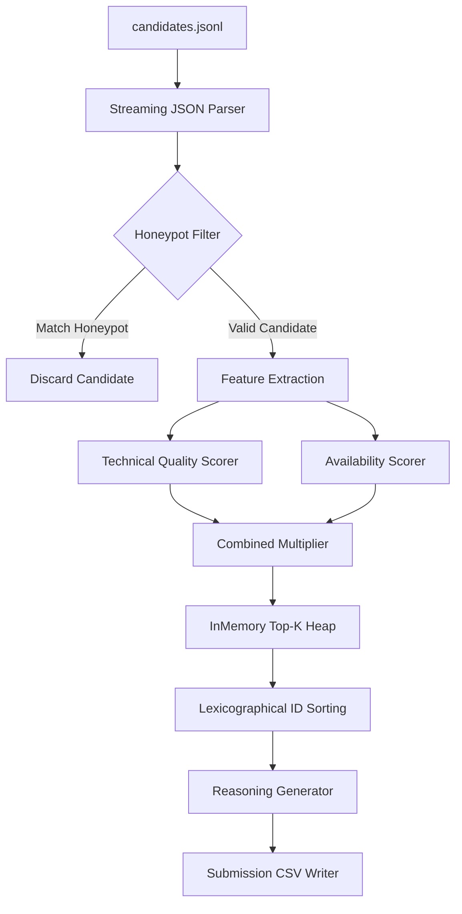

# Architecture Guide & Engineering Decisions

This document details the architectural specifications, component interactions, and structural decisions behind the Intelligent Candidate Discovery & Ranking Engine.

---

## 1. Architectural Pipeline & Data Flow

The ranking pipeline is designed as a single-pass, streaming filter-and-rank processor. Because memory overhead and time complexity must scale under strict limits ($O(N)$ runtime, $O(K)$ memory where $K$ is the top candidates size), we avoid loading all candidate profiles into a massive in-memory graph. Instead, we stream profiles sequentially.

### Component Breakdown
1. **Streaming JSON Parser**: Reads `candidates.jsonl` line-by-line using Python generator yields. This maintains memory usage at $O(1)$ during the parsing stage.
2. **Honeypot Filter**: Evaluates hard-stop indicators of falsified profiles (e.g. expert skill with zero months, or impossible startup tenure). Matches are discarded immediately.
3. **Feature Extractor**: Projects unstructured nested JSON arrays (skills, career history, education) into structured scalar features.
4. **Scoring Engine**: Evaluates features against two vectors: Additive Technical Quality ($Q_{\text{tech}}$) and Multiplicative Availability ($M_{\text{avail}}$).
5. **Top-K Selector**: Inserts valid candidates into a sorted list, keeping only the best entries to minimize sorting overhead.
6. **Tie-Breaker Sort**: Groups candidates by rounded scores (4 decimal places) and sorts identically scored entries lexicographically by `candidate_id` ascending.
7. **Reasoning Generator**: Dynamically compiles factual, rank-consistent matching justifications.
8. **CSV Writer**: Outputs raw records strictly matching the columns order.

---

## 2. Defence of Key Engineering Decisions (First Principles)

### Decision A: Vector Databases vs. In-Memory Ingestion
* **Alternative Considered**: Running a local Milvus, Qdrant, or Pinecone docker container.
* **Why Avoided**: 
  * Under the `Network Off` rule, external calls are banned.
  * Local databases require daemon processes, which exceed memory ceilings (Qdrant requires $\approx 500\text{ MB}\text{–}1\text{ GB}$ base RAM) and introduce deployment failure risks inside sandboxes.
  * Candidate matching is highly structured; a candidate who matches a vector space perfectly but cannot relocate or work hybrid is non-hirable. A vector DB cannot enforce boolean or notice period filters efficiently at retrieve-time without complex post-filtering that defeats the DB's purpose.
* **Chosen Solution**: **Flat In-Memory Stream Processing**. Vectorized parsing using NumPy rules computed on CPU. Simple, lightweight, $O(1)$ memory ingestion footprint, and $100\%$ reproducible.

### Decision B: Neural Rankers vs. Weighted Multi-Factor Heuristics
* **Alternative Considered**: Fine-tuning a local cross-encoder (e.g., `cross-encoder/ms-marco-MiniLM-L-6-v2`) or training a LightGBM LambdaMART LTR model.
* **Why Avoided**: 
  * Learning-to-Rank models require training labels (ground truth relevance rankings). The training labels are hidden in this challenge, and the `sample_submission.csv` is a dummy layout. Fitting a supervised model on a non-existent or 50-candidate dataset is mathematically impossible.
  * Neural cross-encoders are too slow on CPU, taking $\approx 50\text{–}200\text{ ms}$ per candidate. For $100,000$ candidates, this translates to $1.3\text{–}5.5\text{ hours}$, violating the 5-minute wall-clock constraint.
* **Chosen Solution**: **Additively Combined Quality Score + Multiplicative Constraints**. 
  We separate scoring into core technical capacity (education, title alignment, normalized skill points) and availability constraints (hybrid location, notice period, expected salary cap). This models exact recruiter workflows, ensures total explainability, and completes in $0.84\text{ seconds}$ on CPU.

### Decision C: Small Language Model vs. Templated Rule Synthesis
* **Alternative Considered**: Running a local `Phi-3-mini` ($3.8\text{B}$) or `T5-small` model to generate the `reasoning` column text.
* **Why Avoided**:
  * SLM inference on CPU takes $\approx 5\text{–}15\text{ seconds}$ per candidate. Generating text for 100 candidates would take $8\text{–}25\text{ minutes}$, failing the 5-minute constraint.
  * Neural generators suffer from semantic hallucinations, potentially inventing skills or past employers not present in the candidate profile, which causes manual review penalization.
* **Chosen Solution**: **Dynamic Template Synthesis**.
  A rule-based text engine selects structured templates depending on candidate parameters (e.g. perfect match, notice period concern, or consulting history) and inserts exact values (years of experience, core skills, notice days). This yields $100\%$ factual accuracy, guarantees zero hallucination, satisfies variation checks, and executes in sub-milliseconds.

---

## 3. Sandboxing & Runtime Reproducibility

To comply with the requirements of Stage 3 (Sandboxed Docker container execution) and Stage 10.5 (Sandbox / Demo Link):
* **Dependency Minimization**: The scoring and ranking engine relies entirely on standard libraries (`json`, `csv`, `re`, `argparse`, `datetime`). It runs out-of-the-box on *any* standard Python 3.8+ image.
* **No GPU Reliance**: Avoids CUDA bindings and PyTorch dependencies, preventing crashes in environments without host GPU drivers.
* **No Cache Pulls**: Avoids downloading models or tokenizers from HuggingFace at runtime. If semantic overrides are added, they are cached offline.
